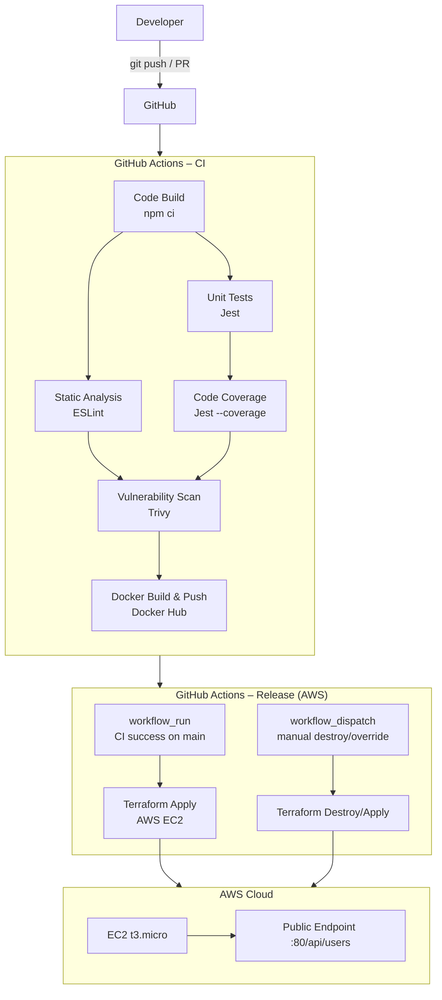

# Demo DevOps NodeJs

A simple REST API application used for the Devsu DevOps technical test.  
Built with **Node.js 18**, **Express**, and **SQLite** (via Sequelize).

---

## Architecture



---

## Getting Started

### Prerequisites

- Node.js 18.15.0
- Docker 24+
- AWS account and GitHub repository secrets configured for release workflow

### Installation

```bash
git clone https://github.com/jml0405/devsu-demo-devops-nodejs.git
cd devsu-demo-devops-nodejs
npm ci
```

### Running locally

```bash
npm run start
# API available at http://localhost:8000/api/users
```

### Running tests

```bash
# Unit tests
npm test

# Tests with coverage report (must pass 80% threshold)
npm run test:coverage

# Static code analysis
npm run lint
```

---

## Docker

### Build

```bash
docker build -t devsu-demo-nodejs .
```

### Run

```bash
docker run -p 8000:8000 \
  -e DATABASE_NAME="./dev.sqlite" \
  -e DATABASE_USER="user" \
  -e DATABASE_PASSWORD="password" \
  devsu-demo-nodejs
```

### Test

```bash
curl http://localhost:8000/api/users
curl -X POST http://localhost:8000/api/users \
  -H "Content-Type: application/json" \
  -d '{"dni":"12345678","name":"Jane Doe"}'
```

---

## CI/CD Pipeline

The pipeline is split into two workflows:

### [`ci.yml`](.github/workflows/ci.yml) – Continuous Integration

Runs on every **push** and **pull request** to `main`.

| Stage | Tool | Notes |
|---|---|---|
| Code Build | `npm ci` | Installs dependencies |
| Static Analysis | ESLint | Zero warnings allowed |
| Unit Tests | Jest | All tests must pass |
| Code Coverage | Jest `--coverage` | ≥80% stmts/lines, ≥70% branches |
| Vulnerability Scan (FS) | Trivy | Scans repository filesystem and uploads report artifact |
| Docker Build & Push | Docker Hub | Image tag computed by `scripts/compute_image_tag.py` |
| Vulnerability Scan (Image) | Trivy | Scans pushed image and uploads report artifact |

Versioning visibility in Actions:
- `run-name` includes run number and branch.
- Workflow `Summary` includes the final image tag (`image:tag`).
- Artifact `image-metadata-<tag>` stores image tag, image ref, commit and run metadata.

### [`release.yml`](.github/workflows/release.yml) – Release to AWS EC2

Runs automatically when CI completed successfully from a **push to `main`** (`workflow_run`).
Also supports **manual dispatch** for controlled `deploy`/`destroy`.

| Stage | Tool | Notes |
|---|---|---|
| Resolve release parameters | Bash | Computes CI image tag for automatic runs |
| Terraform init (S3 backend) | Terraform | Uses remote state in S3 |
| Deploy to AWS EC2 | Terraform | `terraform apply -auto-approve` with selected image tag |
| Capture outputs | Terraform outputs | Publishes endpoint/IP/image as artifact and summary |
| Manual destroy | Terraform | `workflow_dispatch` with `action=destroy` |

Release visibility in Actions:
- Workflow `Summary` shows deployed image version, source CI run, public IP and endpoint.

### Required GitHub Secrets

| Secret | Used by | Description |
|---|---|---|
| `DOCKERHUB_USERNAME` | ci.yml, release.yml | Docker Hub username |
| `DOCKERHUB_TOKEN` | ci.yml | Docker Hub access token |
| `AWS_ACCESS_KEY_ID` | release.yml | AWS access key for Terraform |
| `AWS_SECRET_ACCESS_KEY` | release.yml | AWS secret key for Terraform |
| `AWS_TF_STATE_BUCKET` | release.yml | S3 bucket name for Terraform remote state |

### Pipeline Evidence (for submission)

- CI run URL: `<paste-github-actions-ci-run-url>`
- Release run URL: `<paste-github-actions-release-run-url>`
- Trivy artifacts: `trivy-fs-report`, `trivy-image-report`
- AWS artifacts: `aws-terraform-output-<image_tag>`

---

## IaC – Terraform (AWS)

The active release target is AWS EC2 using Terraform in `terraform-aws/`.

### Install Terraform

```bash
# Arch Linux
sudo pacman -S terraform

# Or via official installer
curl -fsSL https://releases.hashicorp.com/terraform/1.7.5/terraform_1.7.5_linux_amd64.zip \
  | sudo busybox unzip -d /usr/local/bin -
```

### Terraform AWS Resources

| File | Purpose |
|---|---|
| `terraform-aws/versions.tf` | AWS provider and S3 backend configuration |
| `terraform-aws/network.tf` | VPC, subnet, route table, internet gateway |
| `terraform-aws/security.tf` | Security group rules |
| `terraform-aws/compute.tf` | EC2 instance and container bootstrap via user data |
| `terraform-aws/outputs.tf` | Endpoint and deployment metadata outputs |
| `terraform-aws/variables.tf` | Deployment parameters |

### Legacy local Terraform

`terraform/` (Kubernetes + Minikube) is kept for local reference only and is no longer used by the release pipeline.

### What gets created in AWS

- VPC + public subnet + internet gateway + route table
- Security group exposing the application port
- One EC2 instance (`t3.micro` by default)
- Docker container running `devsu-demo-nodejs` image

### Bootstrap remote Terraform state (one-time)

Create an S3 bucket for state before using the workflow:

```bash
aws s3api create-bucket \
  --bucket <your-terraform-state-bucket> \
  --region us-east-2 \
  --create-bucket-configuration LocationConstraint=us-east-2

aws s3api put-bucket-versioning \
  --bucket <your-terraform-state-bucket> \
  --versioning-configuration Status=Enabled

aws s3api put-bucket-encryption \
  --bucket <your-terraform-state-bucket> \
  --server-side-encryption-configuration \
  '{"Rules":[{"ApplyServerSideEncryptionByDefault":{"SSEAlgorithm":"AES256"}}]}'
```

### Configure GitHub secrets for AWS workflow

- `AWS_ACCESS_KEY_ID`
- `AWS_SECRET_ACCESS_KEY`
- `AWS_TF_STATE_BUCKET` (the bucket created above)
- `DOCKERHUB_USERNAME` (already used by CI)

### Deploy in AWS from GitHub Actions

Automatic deploy:
1. Push to `main`.
2. CI builds/pushes the image.
3. Release workflow auto-deploys to AWS.

Manual deploy override:
1. Open **Actions** -> **Release – Deploy to AWS EC2**.
2. Click **Run workflow** and choose:
3. `action=deploy`
4. `image_tag=vX.Y.Z-run-sha` (copy from CI `Summary` or artifact `image-metadata-<tag>`)
5. `aws_region` and `instance_type` as needed.

After deploy, the workflow `Summary` shows:
- deployed image version
- public IP
- public endpoint URL

### Destroy AWS resources (to stop cost)

Run the same workflow with:

- `action=destroy`
- same `aws_region` used for deploy

---
---

## Requirement Checklist

| Requirement | Status | Evidence |
|---|---|---|
| Public GitHub repository with versioned code | Complete | Repository history and workflows |
| Dockerized app (`env`, non-root user, port, healthcheck) | Complete | `Dockerfile` |
| Pipeline with build, tests, lint, coverage, docker build/push | Complete | `.github/workflows/ci.yml` |
| Vulnerability scan (optional) | Complete | Trivy jobs and artifacts in CI |
| Automatic deploy after CI success | Complete | `.github/workflows/release.yml` (`workflow_run`) |
| IaC deploy on public cloud provider (AWS) | Complete | `terraform-aws/` + `.github/workflows/release.yml` |
| README with diagrams and deployment details | Complete | This file |
| Public endpoint URL | Complete after deploy | Release summary and `terraform-aws` outputs |
| `.zip` / `.rar` deliverable for submission | Pending manual step | Generate and attach before final submission |

---

## API Reference

### `GET /api/users`

Returns all users.

```json
[{ "id": 1, "dni": "12345678", "name": "Jane Doe" }]
```

### `GET /api/users/:id`

Returns a single user by ID. Returns `404` if not found.

### `POST /api/users`

Creates a new user.

**Body:**
```json
{ "dni": "12345678", "name": "Jane Doe" }
```

**Response (201):**
```json
{ "id": 1, "dni": "12345678", "name": "Jane Doe" }
```

---

## License

Copyright © 2023 Devsu. All rights reserved.
