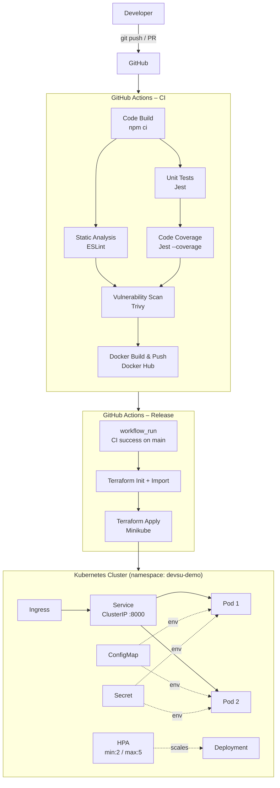

# Demo DevOps NodeJs

A simple REST API application used for the Devsu DevOps technical test.  
Built with **Node.js 18**, **Express**, and **SQLite** (via Sequelize).

---

## Architecture



---

## Getting Started

### Prerequisites

- Node.js 18.15.0
- Docker 24+
- kubectl + minikube (for local k8s)

### Installation

```bash
git clone https://github.com/jml0405/devsu-demo-devops-nodejs.git
cd devsu-demo-devops-nodejs
npm ci
```

### Running locally

```bash
npm run start
# API available at http://localhost:8000/api/users
```

### Running tests

```bash
# Unit tests
npm test

# Tests with coverage report (must pass 80% threshold)
npm run test:coverage

# Static code analysis
npm run lint
```

---

## Docker

### Build

```bash
docker build -t devsu-demo-nodejs .
```

### Run

```bash
docker run -p 8000:8000 \
  -e DATABASE_NAME="./dev.sqlite" \
  -e DATABASE_USER="user" \
  -e DATABASE_PASSWORD="password" \
  devsu-demo-nodejs
```

### Test

```bash
curl http://localhost:8000/api/users
curl -X POST http://localhost:8000/api/users \
  -H "Content-Type: application/json" \
  -d '{"dni":"12345678","name":"Jane Doe"}'
```

---

## CI/CD Pipeline

The pipeline is split into two separate workflows:

### [`ci.yml`](.github/workflows/ci.yml) – Continuous Integration

Runs on every **push** and **pull request** to `main`.

| Stage | Tool | Notes |
|---|---|---|
| Code Build | `npm ci` | Installs dependencies |
| Static Analysis | ESLint | Zero warnings allowed |
| Unit Tests | Jest | All tests must pass |
| Code Coverage | Jest `--coverage` | ≥80% stmts/lines, ≥70% branches |
| Vulnerability Scan (FS) | Trivy | Scans repository filesystem and uploads report artifact |
| Docker Build & Push | Docker Hub | Image tag computed by `scripts/compute_image_tag.py` |
| Vulnerability Scan (Image) | Trivy | Scans pushed image and uploads report artifact |

### [`release.yml`](.github/workflows/release.yml) – Release to Minikube

Runs automatically only when CI completed successfully from a **push to `main`** (`workflow_run`).

| Stage | Tool | Notes |
|---|---|---|
| Compute image tag from CI metadata | Bash | Reconstructs same tag generated in CI |
| Terraform init | Terraform | Initializes providers |
| Import existing resources | Terraform | Idempotent import to avoid recreate conflicts |
| Deploy to Kubernetes | Terraform | `terraform apply -auto-approve` with the CI image tag |
| Post-deploy verification | `minikube kubectl` | Checks rollout status and lists pods |

### Required GitHub Secrets

| Secret | Used by | Description |
|---|---|---|
| `DOCKERHUB_USERNAME` | ci.yml, release.yml | Docker Hub username |
| `DOCKERHUB_TOKEN` | ci.yml | Docker Hub access token |
| `DB_USER` | release.yml | Passed as `TF_VAR_database_user` |
| `DB_PASSWORD` | release.yml | Passed as `TF_VAR_database_password` |

### Pipeline Evidence (for submission)

- CI run URL: `<paste-github-actions-ci-run-url>`
- Release run URL: `<paste-github-actions-release-run-url>`
- Trivy artifacts: `trivy-fs-report`, `trivy-image-report`

---

## IaC – Terraform

All Kubernetes resources are also managed as code using the [Terraform Kubernetes provider](https://registry.terraform.io/providers/hashicorp/kubernetes/latest).

### Install Terraform

```bash
# Arch Linux
sudo pacman -S terraform

# Or via official installer
curl -fsSL https://releases.hashicorp.com/terraform/1.7.5/terraform_1.7.5_linux_amd64.zip \
  | sudo busybox unzip -d /usr/local/bin -
```

### Deploy with Terraform (local / minikube)

```bash
# Copy and optionally edit vars
cp terraform/terraform.tfvars.example terraform/terraform.tfvars

cd terraform/
terraform init
terraform plan -var="image_tag=latest"
terraform apply -auto-approve -var="image_tag=latest"
```

### Tear down

```bash
cd terraform/
terraform destroy -auto-approve
```

### Terraform Resources

| File | Resource |
|---|---|
| `namespace.tf` | `kubernetes_namespace` |
| `configmap.tf` | `kubernetes_config_map` |
| `secret.tf` | `kubernetes_secret` |
| `deployment.tf` | `kubernetes_deployment` |
| `service.tf` | `kubernetes_service` |
| `hpa.tf` | `kubernetes_horizontal_pod_autoscaler_v2` |
| `ingress.tf` | `kubernetes_ingress_v1` |

---

## Kubernetes Deployment

### Local (minikube + terraform)

```bash
# Start minikube with ingress
minikube start
minikube addons enable ingress
kubectl config use-context minikube

# Deploy with Terraform
cd terraform/
terraform init
terraform apply -auto-approve \
  -var="image_name=<dockerhub_user>/devsu-demo-nodejs" \
  -var="image_tag=latest" \
  -var="database_user=user" \
  -var="database_password=password" \
  -var="kubeconfig_context=minikube"

# Verify pods (should show 2 Running)
minikube kubectl -- get pods -n devsu-demo

# Check HPA
minikube kubectl -- get hpa -n devsu-demo

# Check ingress
minikube kubectl -- get ingress -n devsu-demo

# Access via port-forward
minikube kubectl -- port-forward svc/devsu-demo-svc 8000:8000 -n devsu-demo
curl http://localhost:8000/api/users
```

> This project is deployed to **local Minikube** for the technical test.  
> Public endpoint URL: `N/A (local environment)`

### Kubernetes Resources

| Resource | Name | Detail |
|---|---|---|
| Namespace | `devsu-demo` | Isolated namespace |
| ConfigMap | `devsu-demo-config` | `DATABASE_NAME`, `PORT`, `NODE_ENV` |
| Secret | `devsu-demo-secret` | `DATABASE_USER`, `DATABASE_PASSWORD` |
| Deployment | `devsu-demo-deployment` | 2 replicas, non-root, liveness+readiness probes |
| HPA | `devsu-demo-hpa` | Min 2 / Max 5 pods, CPU 70% / Mem 80% |
| Service | `devsu-demo-svc` | ClusterIP on port 8000 |
| Ingress | `devsu-demo-ingress` | nginx, host `devsu-demo.local` |

---

## Requirement Checklist

| Requirement | Status | Evidence |
|---|---|---|
| Public GitHub repository with versioned code | Complete | Repository history and workflows |
| Dockerized app (`env`, non-root user, port, healthcheck) | Complete | `Dockerfile` |
| Pipeline with build, tests, lint, coverage, docker build/push | Complete | `.github/workflows/ci.yml` |
| Vulnerability scan (optional) | Complete | Trivy jobs and artifacts in CI |
| Kubernetes deploy from pipeline | Complete | `.github/workflows/release.yml` |
| Kubernetes resources (ConfigMap, Secret, Ingress, HPA, etc.) | Complete | `terraform/*.tf` |
| At least 2 replicas and horizontal scaling | Complete | `terraform/deployment.tf`, `terraform/hpa.tf` |
| README with diagrams and deployment details | Complete | This file |
| Public endpoint URL | Not applicable | Local Minikube deployment only |
| `.zip` / `.rar` deliverable for submission | Pending manual step | Generate and attach before final submission |

---

## API Reference

### `GET /api/users`

Returns all users.

```json
[{ "id": 1, "dni": "12345678", "name": "Jane Doe" }]
```

### `GET /api/users/:id`

Returns a single user by ID. Returns `404` if not found.

### `POST /api/users`

Creates a new user.

**Body:**
```json
{ "dni": "12345678", "name": "Jane Doe" }
```

**Response (201):**
```json
{ "id": 1, "dni": "12345678", "name": "Jane Doe" }
```

---

## License

Copyright © 2023 Devsu. All rights reserved.
